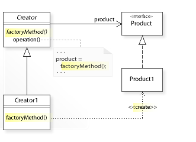
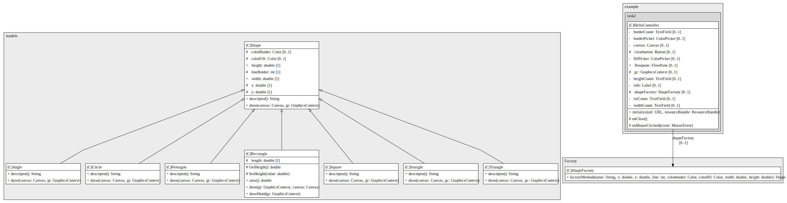
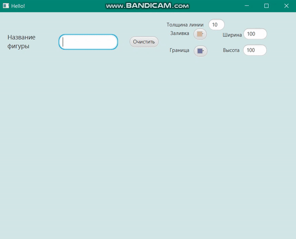

# Task 2 - Фабричный метод

## Условие задачи
Требуется написать программу, которая рисует фигуру по заданному пользователем названию.

<details>
    <summary><ins><b>Теоретическая справка</b></ins></summary>
    <p>
        <b>Фабричный метод</b> — это порождающий паттерн проектирования, который определяет общий интерфейс для создания объектов в суперклассе, позволяя подклассам изменять тип создаваемых объектов 
    </p>
    <p>
        Для того чтобы система оставалась независимой от различных типов объектов, паттерн <b>Factory Method</b> использует механизм полиморфизма — классы всех конечных типов наследуют от одного абстрактного базового класса, предназначенного для полиморфного использования. В этом базовом классе определяется единый интерфейс, через который пользователь будет оперировать объектами конечных типов.
    </p>
    <p>
        Для обеспечения относительно простого добавления в систему новых типов паттерн <b>Factory Method</b> локализует создание объектов конкретных типов в специальном классе-фабрике. Методы этого класса, посредством которых создаются объекты конкретных классов, называются фабричными.
    </p>
<hr/>
    
</details>

## Выполнение задания

> [!IMPORTANT]
> Реализация интерфейса `Creator`:

```java
public interface Creator {
    public Shape factoryMethod(String name, double x, double y, int line, Color colorborder, Color colorfill, double width, double height
    ) ;
}

public class ShapeFactory implements Creator {
    @Override
    public Shape factoryMethod(String name, double x, double y, int line, Color colorborder, Color colorfill, double width, double height ){
        if(Objects.equals(name, "Пятиугольник")){
            return new  Pentagon(line, colorborder, colorfill, x, y,0,0);
        }
        else if(Objects.equals(name, "Квадрат")){
            return new Square(line, colorborder, colorfill, x, y, width, height);
        }
        else if(Objects.equals(name, "Треугольник")){
            return new Triangle(line, colorborder, colorfill, x, y,0,0);
        }
        else if(Objects.equals(name, "Угол")){
            return new Angle(x,y,line, colorborder, colorfill,0,0);
        }
        else if (Objects.equals(name, "Линия") ||Objects.equals(name, "Прямая")){
            return new Straight(line, colorborder, colorfill, x, y,0,0);
        }
        else if(Objects.equals(name, "Круг")){
            return new Circle(line, colorborder, colorfill, x, y, width, height);
        }
        else{
            return null;
        }
    }
}
```
> [__Содержимое класса контроллера__](src/main/java/com/example/task2/HelloController.java) `HelloController`

> [__Содержимое класса приложения__](src/main/java/com/example/task2/HelloApplication.java) `HelloApplication`

- [__Реализация клаcса__](src/main/java/models/Shape.java) `Shape`
- [__Реализация класcа__](src/main/java/models/Circle.java) `Circle`
-  [__Реализация класcа__](src/main/java/models/Angle.java) `Angle`
-   [__Реализация класcа__](src/main/java/models/Straight.java) `Straight`
-    [__Реализация класcа__](src/main/java/models/Pentagon.java) `Pentagon`
- [__Реализация клаcса__](src/main/java/models/Square.java) `Square`
- [__Реализация клаcса__](src/main/java/models/Triangle.java) `Triangle` 

## Диаграмма UML
> [!NOTE]
> Диаграмма классов `models`:



## Результат выполнения

> [!IMPORTANT]
> __Демонстрация работоспособности приложения__:


