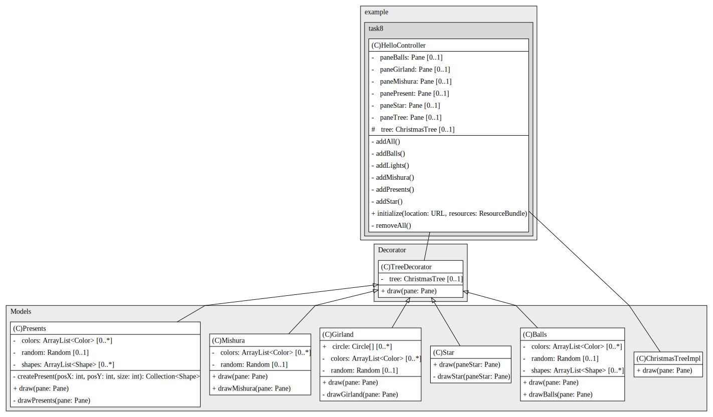
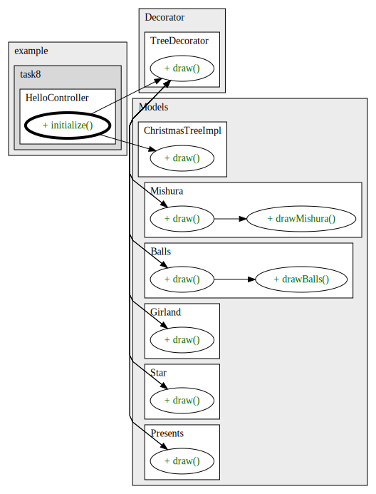
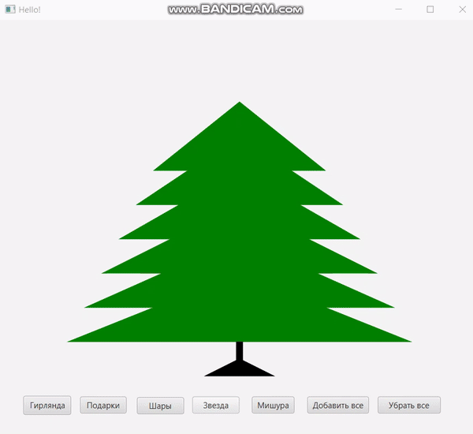

## Task8 | Декоратор
### Условия задачи
Требуется написать программу, которая  декорирует елку в соответствие с выбором пользователя.
### Теоретическая справка
Паттерн Decorator позволяет пользователю добавлять новые функциональные возможности к существующему объекту, не изменяя его структуру. Этот паттерн  действует как оболочка (обертка)  для существующего класса.
### Диаграмма классов

### Результат

