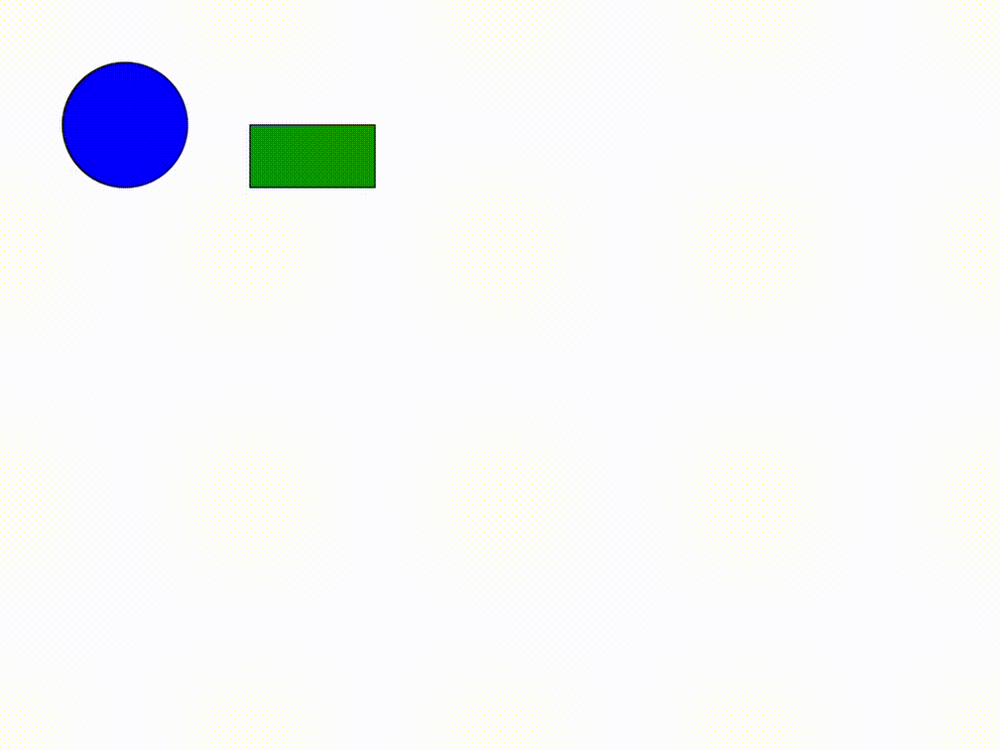

## Task3 | Хранитель
Постановка задачи: На рабочей панели графического редактора выбрать фигуру и путем перетаскивания изменить ее положение (переместить ее на панели), реализовать выбор и перетаскивание нескольких фигур.

Набор фигур для запуска приложения

Перетаскивание состоит:

Шаг 1. Выбор фигуры по щелчку мыши (н-р, событие MouseEvent.MOUSE_PRESSED).

Шаг 2. Выделение фигуры (изменение свойств фигуры и сохранение текущих).

Шаг 3. Изменение положения фигуры и возвращение фигуры к прежнему виду.

Необходимо организовать временное хранение состояния фигуры  

### Результат

