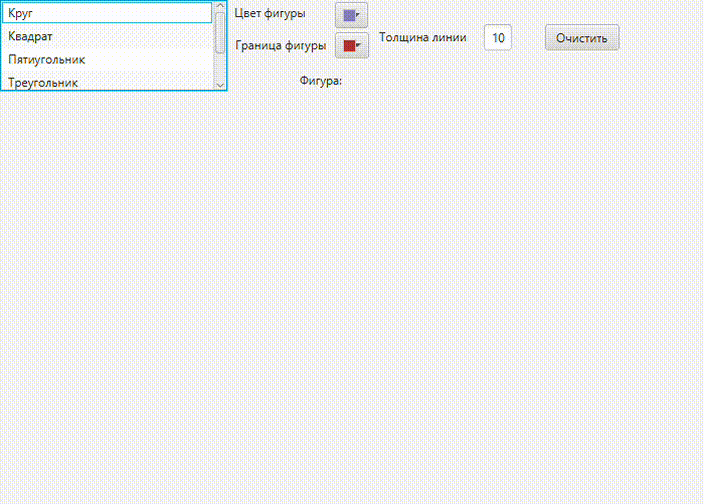

## Task6 | Прототип
Условие задачи.   
Требуется написать программу, которая  отображает  выбранную пользователем фигуру (круг, треугольник, прямоугольник)  из списка в произвольном месте окна.

###Теоретическая справка. Прототип.
Паттерн Prototype используется для создания новых объектов на основе прототипа. Прототип - это уже существующий в системе объект, который поддерживает операцию клонирования, то есть умеет создавать копию самого себя. Таким образом, для создания объекта некоторого класса достаточно выполнить операцию clone() соответствующего прототипа.

 Паттерн Prototype реализует подобное поведение следующим образом.

  Все классы, объекты которых нужно создавать, должны быть подклассами одного общего абстрактного базового класса. 

Этот базовый класс должен объявлять интерфейс метода clone(). 

Также здесь могут объявляться  и другие общие методы, например, initialize() в случае, если после клонирования нужна инициализация вновь созданного объекта. 

Может быть достаточно - в объекте реализовать интерфейс Cloneble.

### Результат

